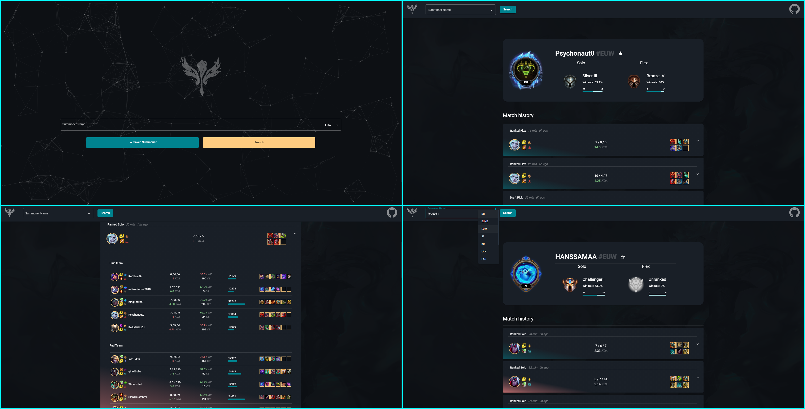

# Taric

Get stats and detailed match history of your league of legends games with Taric!

## Overview

## Before start

This project was generated with [Angular CLI](https://github.com/angular/angular-cli) version 10.1.6.

Make sure you have npm and Angular CLI installed. To Install Angular CLI, oopen a terminal and run `npm install -g @angular/cli`.
If you clone this app run `npm i` to install all dependencies needed for the project. After that you can run this app locally using `ng serve` command.
All the things to do when the project is cloned are well commented in the code.
To have more information about angular basic commands, [read here](#angular-base-commands).

## General information

If you don't know what player to search you can go with these example:

`Psychonaut0, EUW` | `Lyrae051, EUW` | `BULKMollic1, EUW`

The search is not case sensitive, so you don't need to uppercase or lowercase.

### Features

Taric is a website build with Angular. It has a simple, minimal and aesthetic home page for searching any summoner you want. You can look to your rank informations, win rate, and 
detailed match history. You can pin your favourite summoner to search them easily and fast in the home page. Try this feature clicking on the star near your name in the dashboard.
You can look for in-depth match stats such as CS, KDA, Kill partecipation and damage dealt.

### Aesthetic and graphic features powered by Angular Material

Dialog, snackbars, cards and button are powered by Angular Material. It gives to the website a very modern and flat appearance.
Visit [this](https://material.angular.io/guide/getting-started) to get started with angular material.
Visit [this](https://material.angular.io/components/categories) to look at the components used in the app.

### Development server

Run `ng serve` for a dev server. Navigate to `http://localhost:4200/`. The app will automatically reload if you change any of the source files.

## Angular base commands

Basic commands to run the app and creating new component are given below.

### Code scaffolding

Run `ng generate component component-name` to generate a new component. You can also use `ng generate directive|pipe|service|class|guard|interface|enum|module`.

### Build

Run `ng build` to build the project. The build artifacts will be stored in the `dist/` directory. Use the `--prod` flag for a production build.

### Running unit tests

Run `ng test` to execute the unit tests via [Karma](https://karma-runner.github.io).

### Running end-to-end tests

Run `ng e2e` to execute the end-to-end tests via [Protractor](http://www.protractortest.org/).

### Further help

To get more help on the Angular CLI use `ng help` or go check out the [Angular CLI README](https://github.com/angular/angular-cli/blob/master/README.md).

=======

